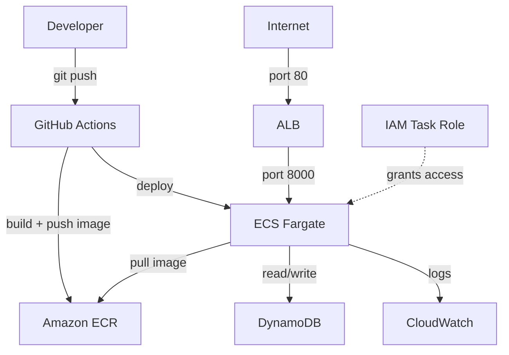

# AWS ECS URL Shortener

A production-grade URL shortener built with FastAPI, deployed on AWS ECS Fargate via Terraform and GitHub Actions CI/CD. Demonstrates containerized microservice deployment with infrastructure as code.

## Architecture



**CI/CD Flow:**
1. Developer pushes code to `main` branch
2. GitHub Actions builds Docker image and pushes to ECR
3. GitHub Actions updates ECS Task Definition with new image
4. ECS performs rolling deployment — zero downtime

## Tech Stack

| Layer | Technology |
|---|---|
| Application | Python 3.12, FastAPI, boto3 |
| Container | Docker, Amazon ECR |
| Orchestration | Amazon ECS Fargate |
| Load Balancer | Application Load Balancer (ALB) |
| Database | Amazon DynamoDB (PAY_PER_REQUEST) |
| Infrastructure | Terraform v1.14, modular VPC |
| CI/CD | GitHub Actions |
| Observability | CloudWatch Logs (7-day retention) |
| Security | IAM least-privilege Task Roles |

## API Endpoints

```
GET  /health        → health check (used by ALB)
GET  /version       → service version
POST /shorten       → create short URL
GET  /{code}        → redirect to original URL (increments click counter)
GET  /stats/{code}  → get URL statistics
```

**Example:**
```bash
# Create short URL
curl -X POST https://<alb-dns>/shorten \
  -H "Content-Type: application/json" \
  -d '{"url": "https://www.github.com/bahasaki"}'

# Response
{"short_url": "http://<alb-dns>/b3HfUp", "code": "b3HfUp"}

# Get stats
curl https://<alb-dns>/stats/b3HfUp
{"code": "b3HfUp", "url": "https://www.github.com/bahasaki", "clicks": 5}
```

## Project Structure

```
aws-ecs-url-shortener/
├── app/
│   ├── main.py              # FastAPI application
│   ├── requirements.txt     # Python dependencies (pinned versions)
│   └── Dockerfile           # Container definition
├── terraform/
│   ├── main.tf              # All AWS resources (22 total)
│   ├── variables.tf         # Input variables
│   ├── outputs.tf           # ALB DNS and ECR URL
│   ├── terraform.tfvars     # Variable values
│   └── modules/
│       └── vpc/             # Reusable VPC module
│           ├── main.tf
│           ├── variables.tf
│           └── outputs.tf
└── .github/
    └── workflows/
        └── deploy.yml       # CI/CD pipeline
```

## Infrastructure

### AWS Resources (22 total)

**Networking (VPC module):**
- VPC with DNS support enabled
- 2 public subnets across us-east-1a and us-east-1b
- Internet Gateway + Route Table

**Application:**
- ECR repository (image scanning enabled)
- ECS Cluster + Task Definition + Service (Fargate)
- ALB + Target Group + Listener
- DynamoDB table (PAY_PER_REQUEST billing)
- CloudWatch Log Group

**Security:**
- ALB Security Group: allows port 80 from internet
- ECS Security Group: allows port 8000 from ALB only
- ECS Execution Role: ECR pull + CloudWatch logs
- ECS Task Role: DynamoDB access (least privilege)

### Security Design

ECS containers accept traffic only from ALB — direct internet access to containers is blocked:

```
Internet → port 80 → ALB → port 8000 → ECS container
                                              ↓
                                         DynamoDB
```

IAM Task Role grants minimum required permissions:
```json
{
  "Action": [
    "dynamodb:GetItem",
    "dynamodb:PutItem",
    "dynamodb:UpdateItem",
    "dynamodb:DeleteItem"
  ],
  "Resource": "arn:aws:dynamodb:us-east-1:*:table/url-shortener"
}
```

## Architectural Decisions

### Public subnets instead of private + NAT Gateway
**Decision:** ECS tasks run in public subnets with `assign_public_ip = true`.

**Reason:** NAT Gateway costs ~$32/month. For this portfolio project the cost is not justified.

**Production alternative:** Move ECS tasks to private subnets. Use VPC Endpoints for DynamoDB and ECR — eliminates NAT Gateway cost while keeping all traffic within AWS network. This is the preferred pattern for fintech compliance requirements.

### DynamoDB instead of RDS
**Decision:** DynamoDB with PAY_PER_REQUEST billing.

**Reason:** Access pattern is simple — read/write by primary key (`code`). No joins required. DynamoDB returns results in ~1ms regardless of table size.

**Production consideration:** If analytics queries are needed (e.g. "top 10 most clicked URLs"), an RDS or Redshift would be more appropriate.

### Mutable image tags
**Decision:** GitHub Actions tags images with Git commit SHA (e.g. `:17b2bfc`), not `:latest`.

**Reason:** Every deployment is traceable to a specific commit. Easy rollback — just redeploy a previous task definition revision.

## Deployment

### Prerequisites
- AWS CLI configured
- Terraform v1.14+
- Docker

### Bootstrap infrastructure

```bash
# 1. Push initial Docker image to ECR (must exist before terraform apply)
aws ecr get-login-password --region us-east-1 | \
  docker login --username AWS --password-stdin \
  <account-id>.dkr.ecr.us-east-1.amazonaws.com

docker build -t url-shortener ./app
docker tag url-shortener:latest \
  <account-id>.dkr.ecr.us-east-1.amazonaws.com/url-shortener:latest
docker push \
  <account-id>.dkr.ecr.us-east-1.amazonaws.com/url-shortener:latest

# 2. Deploy infrastructure
cd terraform
terraform init
terraform apply
```

### GitHub Actions secrets required

| Secret | Description |
|---|---|
| `AWS_ACCESS_KEY_ID` | IAM user access key |
| `AWS_SECRET_ACCESS_KEY` | IAM user secret key |
| `AWS_ACCOUNT_ID` | AWS account ID |

### Teardown

```bash
cd terraform
terraform destroy
```

> Note: ECR images must be deleted manually before `terraform destroy` succeeds.

## Lessons Learned

**DynamoDB import:** During development, a DynamoDB table was created manually for local testing. When Terraform tried to create it, it failed with `ResourceInUseException`. Fixed with `terraform import aws_dynamodb_table.main url-shortener` — taught the value of importing existing resources rather than recreating them.

**FastAPI route ordering:** The wildcard route `/{code}` must be declared last. If placed before `/version`, it intercepts all requests including `/version`, `/health`, etc. Discovered during live testing — the `/version` endpoint returned `{"detail": "URL not found"}` until routes were reordered.

**Docker image bootstrap problem:** GitHub Actions pipeline failed on first run because ECR repository didn't exist yet. Infrastructure must be provisioned before CI/CD pipeline can succeed. Solution: provision Terraform first, then let GitHub Actions handle subsequent deployments.

## Cost Estimate

| Service | Cost |
|---|---|
| ECS Fargate (0.25 vCPU / 0.5 GB) | ~$9/month |
| ALB | ~$6/month |
| DynamoDB (PAY_PER_REQUEST) | ~$0 at low volume |
| ECR (first 500 MB) | Free tier |
| CloudWatch Logs | Free tier |
| **Total** | **~$15/month** |

> This project uses AWS credits. For portfolio demonstration, infrastructure is provisioned for demo then destroyed with `terraform destroy`.
